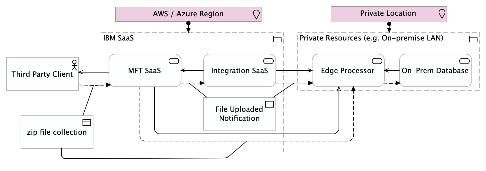

# Hybrid Managed File Transfer Utilization Example

## Overview

This example is provided with the purpose of showing how hybrid deployments work when using edge runtimes in a data exchange flow using IBM Integration (IWHI) SaaS.

The scenario described here is expressed in terms of data flows and servicing relation with the diagram below:

In terms of continuous delivery, this example shows how the general framework principles work with edge code, where they find good applicability, as opposed to the general SaaS approach, which is much more oriented towards a "click on web UI" approach.

The current git repository offers a step by step approach, where the steps are tagged git commits instead of separate folders. This way differences between steps can be seen in the commit differences themselves.

Steps are numerated with two decimal digits, including a leading zero in case the step number is lower than 10.

This tutorial itself is built in an incremental manner. Markdown files describing the steps themselves evolves as the tutorial is created.

At the moment of its initial planning, that is at `step01`, the tutorial contains the following steps:

- [`step01`](docs/step01.md): Ensure basic prerequisites and familiarize with the `lazygit` sandbox
- [`step02`](docs/step02.md): Ensure all prerequisites and build edge images with debugging and jdbc adapter
- [`step03`](docs/step03.md): Create MFT SaaS user, virtual folder and reception rule. Test using web client
- `step04`: Create the test harness automation to send a zip file fixture and enable our TDD approach
- `step05`: Extend MFT processing of the file to produce notifications towards IBM Integration SaaS
- `step06`: Extend IBM Integration to propagate the notification towards and edge instance
- `step07`: Explore in detail packages types and local development arrangements
- `step08`: Extend Edge capabilities to unzip the file and verify its integrity
- `step09`: Extend Edge capabilities to parse and validate inbound records
- `step10`: Extend Edge capabilities to upsert records in a local database

Working in an agile mode, this plan may change as we go ahead and learn further details.

Screenshots are also to be taken as evolving examples, as the product is constantly evolving and different subscriptions may have different detailed views.
