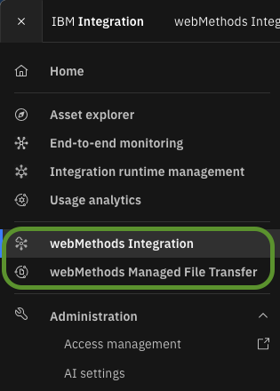
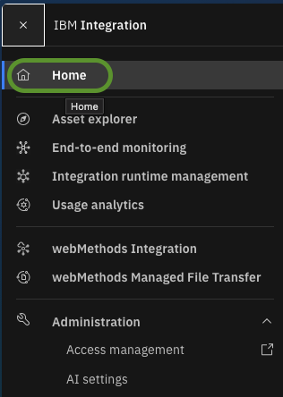
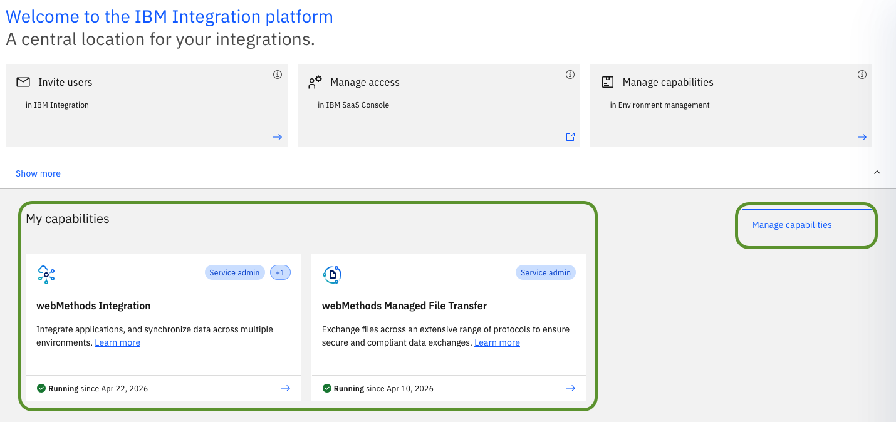
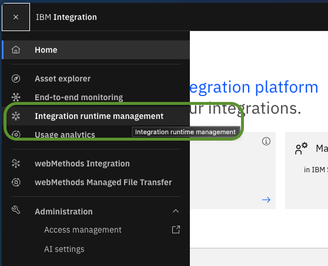
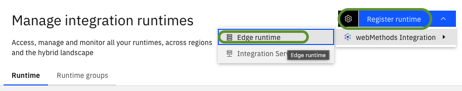
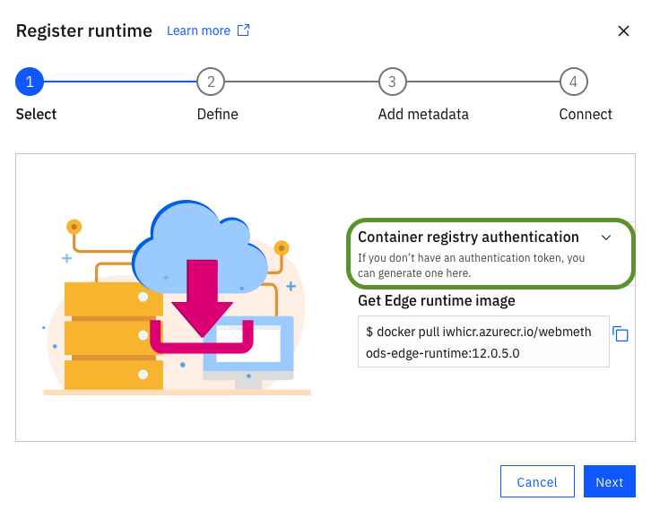
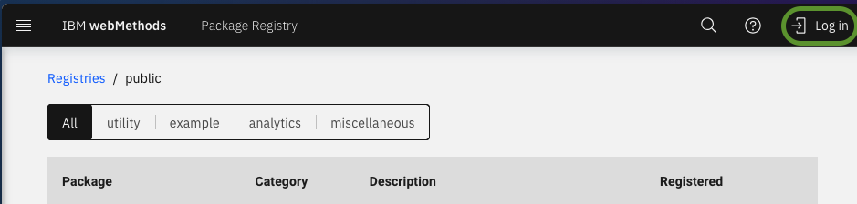
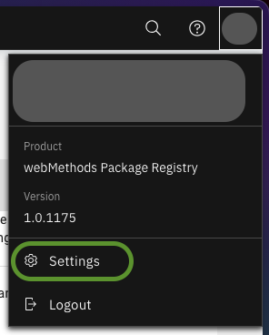

# `step02`: Ensure all prerequisites and build edge images with debugging and jdbc adapter

## SaaS Capabilities

To execute this tutorial you must have access to an IBM webMethods SaaS tenant having the MFT and Integration capabilities enabled. You should see at least the following entries in the hamburger menu of the tenant.



If these are not visible, they can be activated using the subscription management console. To do that go to the home screen and enable them if necessary. Mind that all newly activated capabilities incur cost in terms of resource units.





## Edge Image Access

This tutorial will instantiate edge runtimes based on the webMethods edge image. For the moment we need to ensure we have access to the container image, as they are not public.

Open the `Integration runtime management` section:



We will now begin the wizard to add a runtime, but we will stop after obtaining the container image.

Click on `Register runtime` and then select `Edge runtime`:



In the first step of the opening wizard you can see immediately the pull command to execute, e.g.

```sh
docker pull iwhicr.azurecr.io/webmethods-edge-runtime:12.0.5.0
```

However, the command requires authentication and this can be done using the `Container registry authentication` helper drop down:



Follow the instructions and execute the login, then pull the image. Interrupt the wizard, as we were only interested in the image for now.

## Local Edge Image Customization - Adding the JDBC Adapter Package

In this section we use the wpm tool (webMethods Package Manager) to add the JDBC package to the edge image. This is an example on how to execute this type of extension, for real production images use this recipe to add any other available packages to extend your edge images.

Packages are downloaded from https://packages.webmethods.io and are not freely available. We need to generate the appropriate download credentials.

Open the browser to https://packages.webmethods.io and execute the login using the same IBM identity you use to access the SaaS tenant.



Open the `Settings` from the user icon on the upper right.



Generate a new access token and save it somewhere safe such as in a password manager.

The current step commit contains a subfolder called `other-repos`. Open a new command line window in that folder and clone this [helper container images builder repo](https://github.com/ibm-webmethods-continuous-delivery/7u-container-images). Let's get accustomed with our sandbox while executing this step.

```sh
# if the sandbox is not up, start it:
# cd <tutorial-home>/1c-mft-hybrid-example/.sbx/1c-mft-example

docker compose up -d

# get a shell in the container

docker exec -it 1c-mft-example sh

cd other-repos

pwd
```

As an intermediary check step, this last pwd command should have returned the following:

```text
/repo/1c-mft-hybrid-example $ cd other-repos/
/repo/1c-mft-hybrid-example/other-repos $ pwd
/repo/1c-mft-hybrid-example/other-repos
```

Now clone the given repo. We fix a tag here to improve tutorial's reproducibility, however you may clone newer commits as the edge container image version evolves in time.

```sh
git clone -b point-in-time/20260922_1 https://github.com/ibm-webmethods-continuous-delivery/7u-container-images.git
ls -lart
```

This last command should produce an output similar to the following:

```text
/repo/1c-mft-hybrid-example/other-repos $ ls -lart
total 4
drwxr-xr-x   12 mftexample mftexample       384 Sep 22 08:57 ..
-rw-r--r--    1 mftexample mftexample        14 Sep 22 08:57 .gitignore
drwxr-xr-x    4 mftexample mftexample       128 Sep 22 09:26 .
drwxr-xr-x   10 mftexample mftexample       320 Sep 22 09:26 7u-container-images
/repo/1c-mft-hybrid-example/other-repos $
```

Although the cloned repository contains a number of example images, we are only interested in the ones related to the edge, in particular `edge-jdbc`.

Inside the same sandbox shell as above, execute the following:

```sh
cd /repo/1c-mft-hybrid-example/other-repos/7u-container-images/images/u/edge/jdbc/
cp set-env-example.sh set-env.sh
```

Now edit the file `set-env.sh` and write inside the WPM token we prepared above. You may use neovim inside the sandbox.

```sh
nvim set-env.sh
```

Take a moment to inspect the files in the folder. Observe how Dockerfile is built and how the wpm token is protected not to be accidentally exposed in the history of commands. Also note the staging approach, pointing to an intention to have packaging tools like WPM used only in intermediary stages.

After saving the `set-env.sh` file, we open a new shell on the host, where we can execute docker commands. Note that for security purposes, we will not use "docker in docker" for the sandbox coming with the tutorial, but we will use another special build and scan sandbox that comes with the images builder. For this purpose, on the above opened shell, navigate to the folder `<tutorial-home>/1c-mft-hybrid-example/other-repos/7u-container-images/.sbx/7u-ci-builder/`. There, execute the following command.

Note: at the moment of this tutorial preparation, the WPM tool requires ssh access to github to successfully complete the package installation.

```sh
# Linux / macOS
# if not yet prepared, prepare the .env file
cp EXAMPLE.env .env
# Edit the .env file to match the user id and group id you are currently using...
# On Mac or Linux systems you can safely comment them out as they are read dynamically from the user session, however if you want to overwrite the values, the .env file takes precedence.
./build.sh --scan u/edge/jdbc
```

```bat
@REM Windows
@REM if not yet prepared, prepare the .env file
copy EXAMPLE.env .env
@REM Edit the .env file to match the user id and group id if needed.
.\build.bat --scan u/edge/jdbc
```

Now you should be able to see the built image.

```sh
# Mac / Linux
docker images | grep edge-jdbc
```

```bat
@REM Windows
docker images | findstr edge-jdbc
```

Note that the `--scan` option also produces a hadolint scan of the Dockerfile and a trivy scan of the resulting image. Inspect the sub-folder `scan-results` of the 7u-ci-builder sandbox. Files like `<tutorial-home>/1c-mft-hybrid-example/other-repos/7u-container-images/.sbx/7u-ci-builder/scan-results/session_20260922_094630/details/u_edge_jdbc/u_edge_jdbc_trivy_20260922_094630_sbom.json` can be inspected for composition, vulnerabilities and packaged licenses with tools like [Sunshine SBOM tool](https://cyclonedx.github.io/Sunshine/).

### Advanced Optional Step

The same way we have built the `edge-jdbc` image, we can build a debugging one called `edge-debug-jdbc`, which packages a verbose pipeline logger for detailed troubleshooting:

```sh
# inside the sandbox container:
cd /repo/1c-mft-hybrid-example/other-repos/7u-container-images/images/u/edge/debug-jdbc/
cp set-env-example.sh set-env.sh
# set the wpm token in set-env.sh
```

```sh
# on the host machine / Linux or macOS:
cd <tutorial-home>/1c-mft-hybrid-example/other-repos/7u-container-images/.sbx/7u-ci-builder
./build.sh --scan u/edge/debug-jdbc
```

```bat
@REM on the host machine / Windows:
cd <tutorial-home>\1c-mft-hybrid-example\other-repos\7u-container-images\.sbx\7u-ci-builder
.\build.bat --scan u/edge/debug-jdbc
```

---

← Previous: [`step01`](step01.md) | [Back to README](../README.md)
