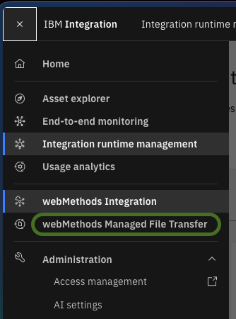
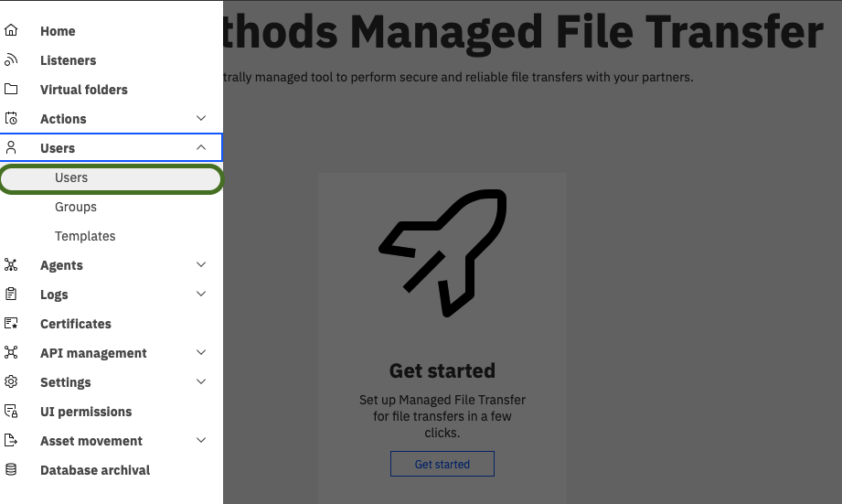

# `step03`: Create MFT SaaS user, virtual folder and reception rule. Test using web client

## Move Repository to `step03`

If you are following the tutorial sequentially using the sandbox container from [`step01`](step01.md), switch the repository to the `step03` tag before proceeding.

Inside the `1c-mft-example` sandbox shell (or using `lazygit` under the **Tags** tab):

```sh
git checkout step03
```

## Create User

Open the MFT capability in the SaaS tenant:



Observe the menu on the left and open the user management section:



---

← Previous: [`step02`](step02.md) | [Back to README](../README.md)