# `step03`: Create MFT SaaS user, virtual folder and reception rule. Test using WebClient

## Move Repository to `step03`

If you are following the tutorial sequentially using the sandbox container from [`step01`](step01.md), switch the repository to the `step03` tag/branch before proceeding.

Inside the `1c-mft-example` sandbox shell (or using `lazygit` under the **Tags** or **Remotes** tab):

```sh
git checkout step03
```

## Create User

Open the MFT capability in the SaaS tenant:

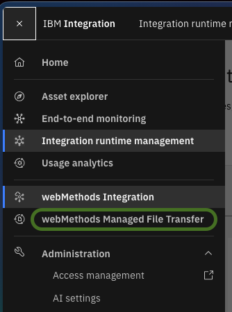

Observe the menu on the left and open the user management section:

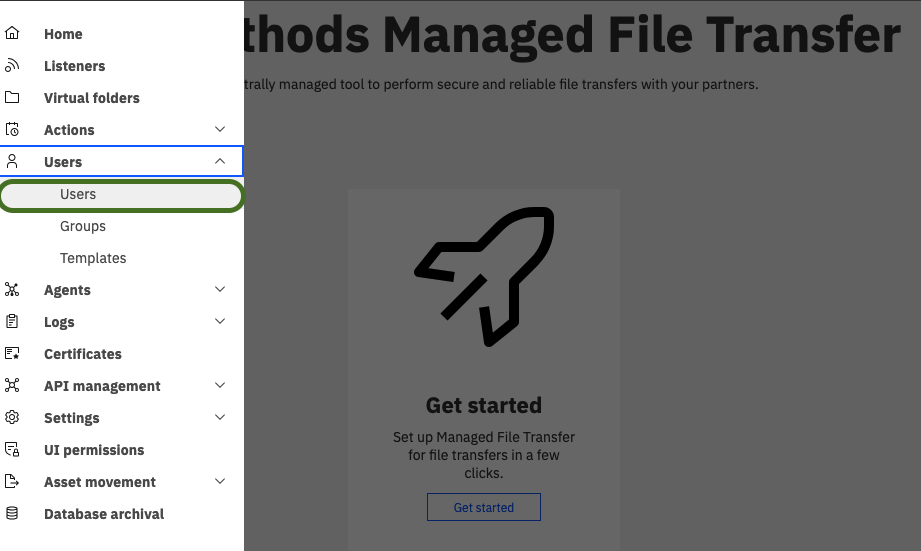

Add a new user.

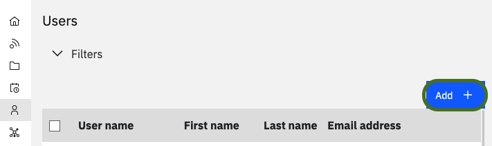

This operation will add a user to the local users database and this user is only recognized by MFT, not Integration Server. Fill in the form and click `Add to user list`, then click on `Create`. Note that multiple users can be added in a single `Create` operation.

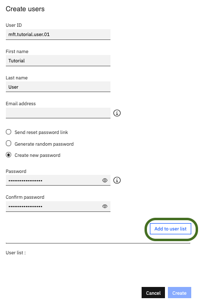

## Create Virtual Folder and Attach the User with All Permissions

Once the user is created, also create a local virtual folder for them. Go to `Virtual folders`:

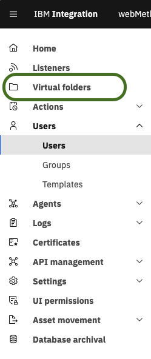

Then click on the plus icon:

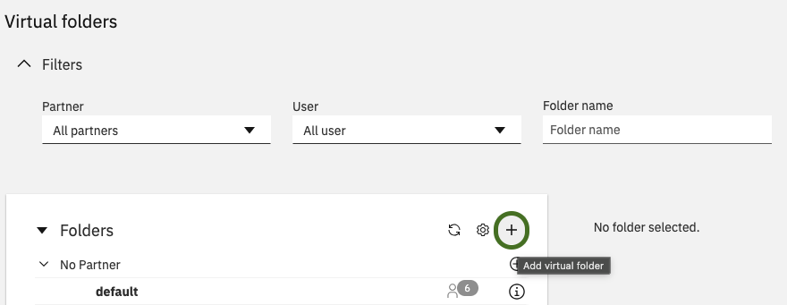

Name the folder `tutorial.1.home`:

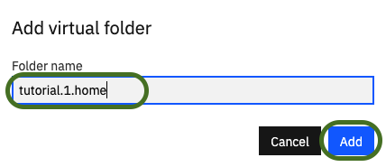

Immediately after clicking `Add`, configure the virtual folder to use the default location, write manually `home/tutorial.1` in the `Browse folder` field, then expand the `Permissions` subsection:

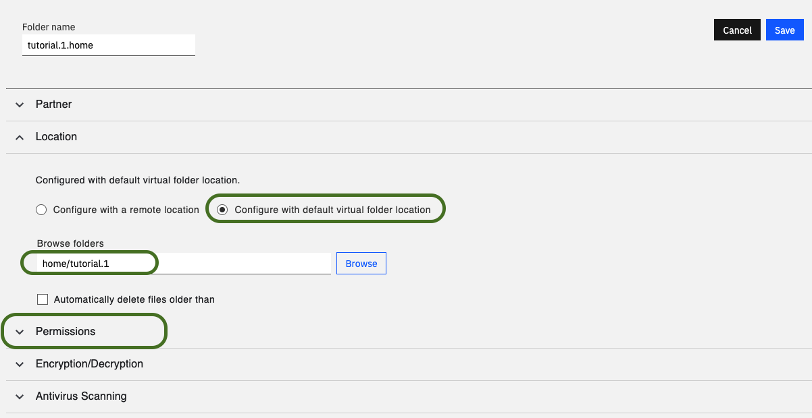

Note: the path `home/tutorial.1` is entered manually because virtual folders map onto a physical location under a hidden base directory managed by the service.

> ⚠️ **Advanced:** Virtual folder paths are independent of their names, so overlaps are possible — for example, a folder named `home` pointing to `home/` would physically contain any subfolder also mapped to another virtual folder. Keep path assignments consistent to avoid unintended sharing.


Add the user we created in the previous step:

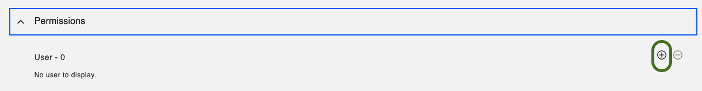

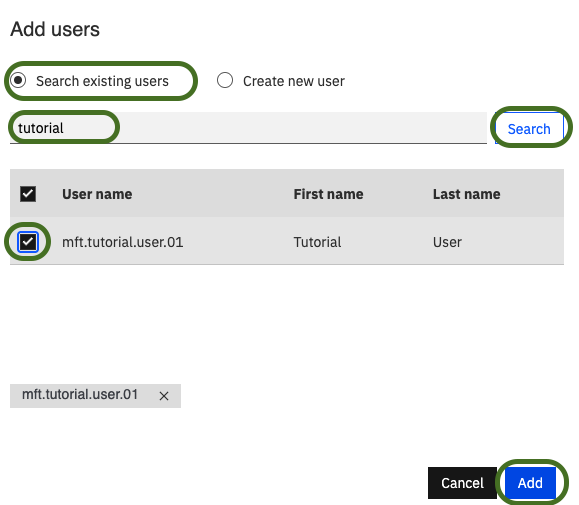

Give all permissions, then save.

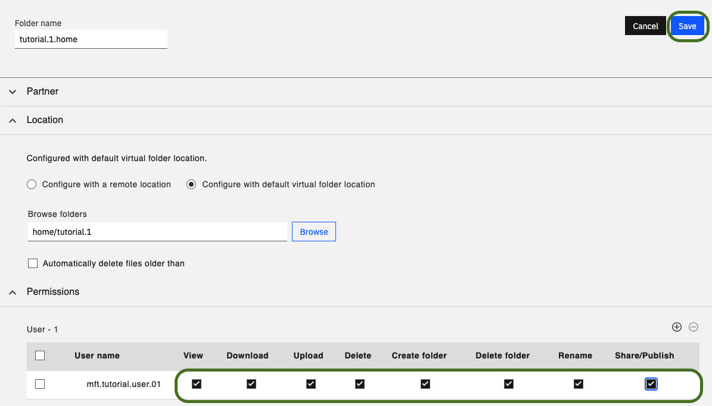

## Verify the User Via the WebClient

WebClient is a web browser application that allows a user to manipulate files within the associated virtual folders.

The WebClient URL can be found in the Listeners section.

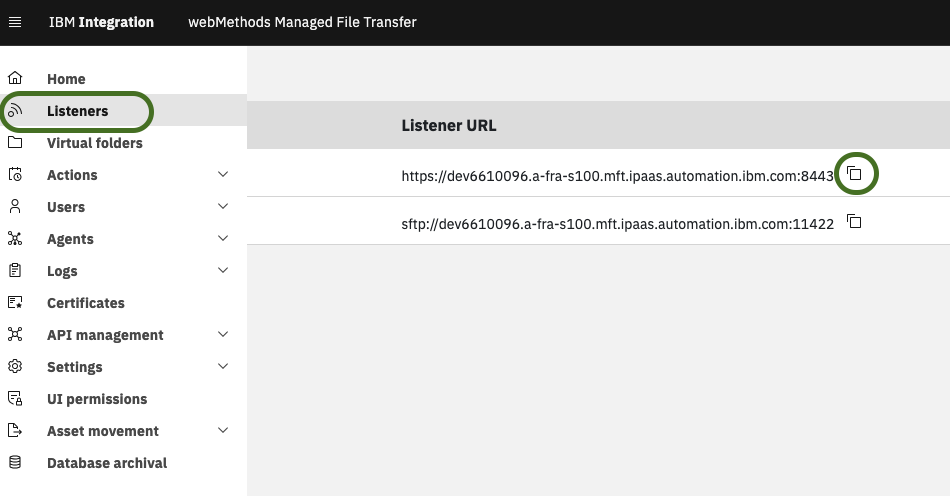

Use the copy button on an HTTP/S listener and open a new browser tab, then paste the URL.

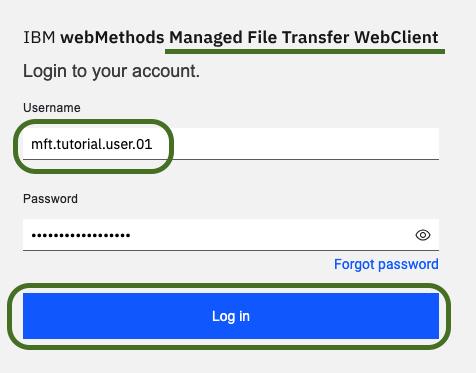

After successfully logging in, create a new folder called `inbound`. We will use it later.

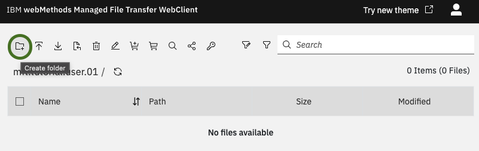

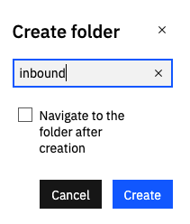

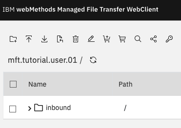

The WebClient lets you browse the contents of virtual folders, whereas the administration interface only shows virtual file system configuration.

## Create a First Rule

First, let's prepare an image that we can upload to the inbound folder. Just use any image or small file, if no file is available use one from the internet, like this one:


Save the image in a local folder for the moment.

Now let's return to the administration UI and add a post-processing rule. Open the `Post-Processing Actions` section:

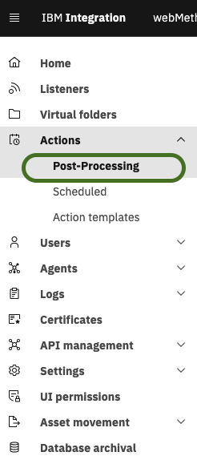

Add a new rule:

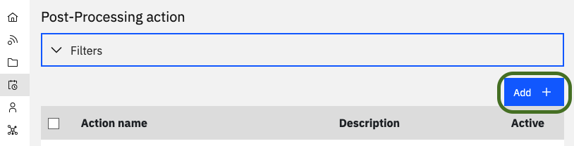

Give the name `tutorial.1.action` and click on `Criteria`:

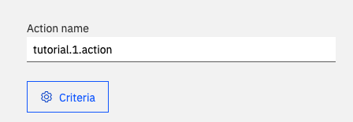

Configure the trigger criteria for `Upload` in the `Specific folder` `/tutorial.1.home/inbound/`:

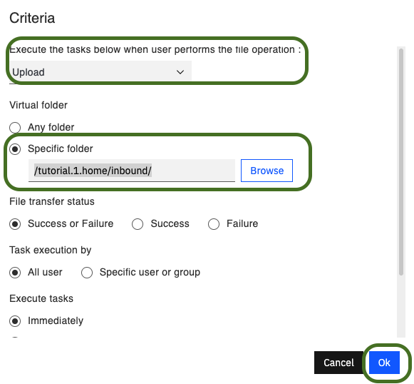

Add a task:

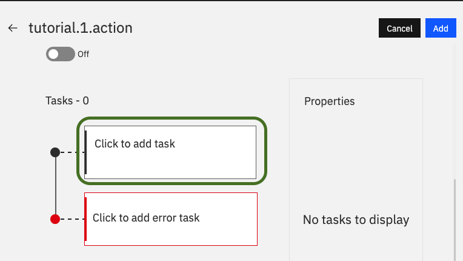

Select `Rename` and then write `{name}.{md5}.received` in the `New file name` field. Scroll up until you see the `Active` button and activate the rule, then click `Add` to save the rule.

Note: `{name}` and `{md5}` are server variables that MFT provides automatically. See [documentation](https://www.ibm.com/docs/en/wm-mft?topic=actions-server-variables) for details.

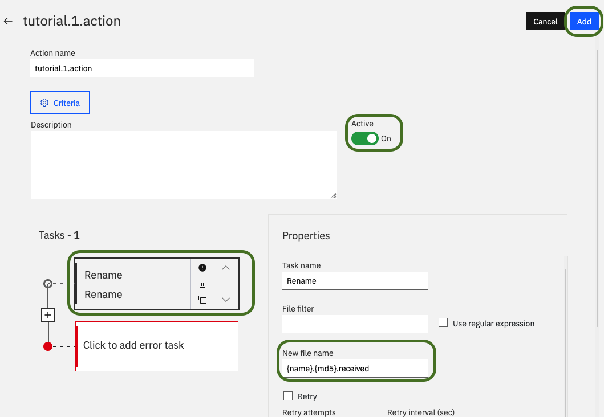

After adding the rule, go back to the post-processing rules page and you should see the rule activated.

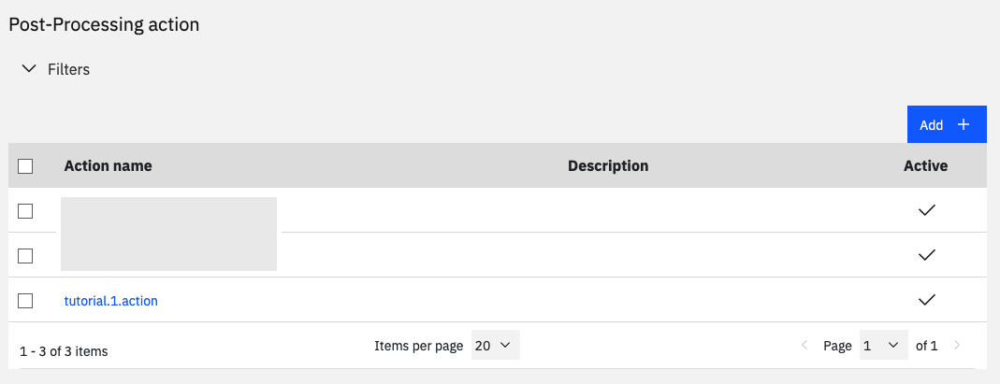

Now switch back to the WebClient and upload the image file we prepared into the `inbound` folder.

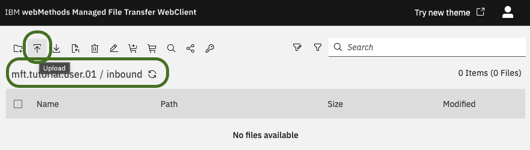

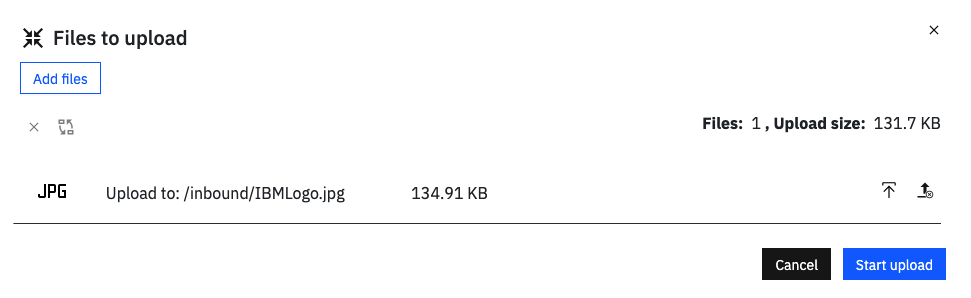

After upload, close the details popup window and note the file in the folder:

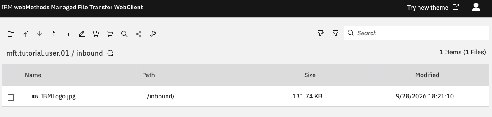

Click the refresh button to the right of `mft.tutorial.user.01/inbound` folder breadcrumb:

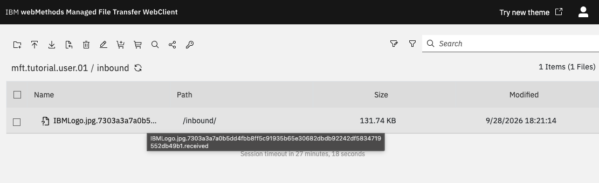

You can observe the file was renamed.

This concludes the tutorial's third step.

**Side note**: At the moment of this tutorial writing, the server variable {md5} actually contains a sha256 checksum. This is visible in the renamed filename. If you think this error should be corrected, please vote the IBM Idea [WEBMMFTS-I-51](https://ideas.ibm.com/ideas/WEBMMFTS-I-51).

---

← Previous: [`step02`](step02.md) | [Back to README](../README.md)