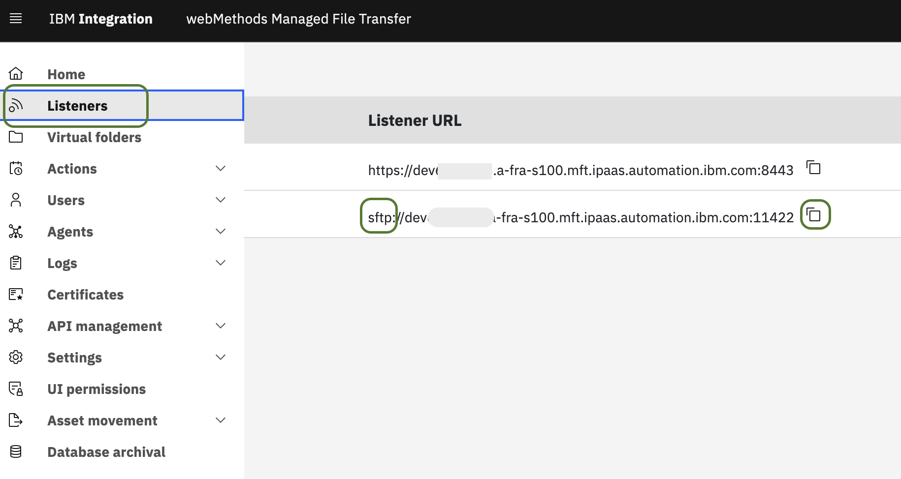
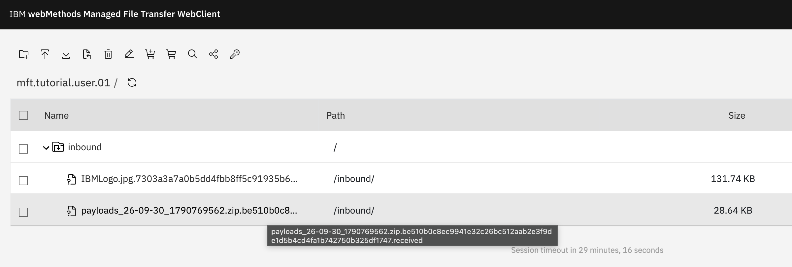

# `step04`: Create the test harness automation to send a zip file fixture and enable our TDD approach

## Move Repository to `step04`

If you are following the tutorial sequentially using the sandbox container from [`step01`](step01.md), switch the repository to the `step04` tag/branch before proceeding.

Inside the `1c-mft-example` sandbox shell (or using `lazygit` under the **Tags** or **Remotes** tab):

```sh
git checkout step04
```

## Overview

In this step we introduce an automated test harness that sends a zip file — containing fixture data files along with their checksums — to the MFT SFTP endpoint. This establishes the TDD foundation for the following steps: each subsequent step will add processing logic that acts on the received file, and we will reuse the same harness to verify the outcome.

In this step we also create a new repository that holds the code driving the SaaS part and deployed on the edge runtimes. This separation is made on purpose, the tutorial repository is didactic in nature, while this second repository is expected to be used as a blueprint for IBM Integration SaaS developers.

To begin with this new repository, either on the host of guest sandbox, go to the folder `other-repos`and clone the new repository using directly the bransh `step04`:

```sh
# Example for sandbox
cd /repo/1c-mft-hybrid-example/other-repos
git clone -b step04 https://github.com/ibm-webmethods-continuous-delivery/1c-mft-hybrid-example-repo.git
```

The harness is located under `09-test-harnesses/send-entities/` in the repository. It builds a small Docker image that bundles the `sftp` client and `sshpass`, then packages the fixture files into a timestamped zip archive and uploads it to the MFT server over SFTP.

## Locate the SFTP Listener

The SFTP connection parameters are obtained from the MFT SaaS administration UI, in the same **Listeners** section used in the previous step to obtain the WebClient URL.

Open the Listeners section and locate the SFTP listener. Copy the **FQDN** and the **port** displayed there — they will be needed in the next section.



> **Note:** The SFTP port is typically a non-standard port (e.g. `11422`). Make sure you copy the exact value shown in the listener card rather than assuming a default.

## Prepare the `.env` File

The harness is configured via environment variables loaded from a `.env` file. A template is provided at [`09-test-harnesses/send-entities/EXAMPLE.env`](../../repos/1c-mft-hybrid-example-repo/09-test-harnesses/send-entities/EXAMPLE.env).

Navigate to the harness folder and copy the template:

```sh
# Linux / macOS
cd ${TUTORIAL_HOME}/1c-mft-hybrid-example/09-test-harnesses/send-entities
cp EXAMPLE.env .env
```

```bat
@REM Windows CMD
cd %TUTORIAL_HOME%\1c-mft-hybrid-example\09-test-harnesses\send-entities
copy EXAMPLE.env .env
```

Now open `.env` in your editor and fill in the four required values:

| Variable | Where to get it | Example |
|---|---|---|
| `MFT_HARNESS_01_SFTP_SERVER_FQDN` | Copied from the SFTP listener (previous section) | `dev12344567.a-fra-s100.mft.ipaas.automation.ibm.com` |
| `MFT_HARNESS_01_SFTP_SERVER_PORT` | Copied from the SFTP listener (previous section) | `11422` |
| `MFT_HARNESS_01_SFTP_CLIENT_USER_NAME` | The MFT user created in `step03` | `mft.tutorial.user.01` |
| `MFT_HARNESS_01_SFTP_CLIENT_USER_PASSWORD` | The password set during user creation in `step03` | *(your password)* |

The remaining variables can be left at their defaults:

| Variable | Default | Notes |
|---|---|---|
| `MFT_HARNESS_01_SFTP_BASE_UPLOAD_DIR` | `inbound` | Must match the virtual subfolder we created in `step03` |
| `MFT_HARNESS_01_DEBUG` | `false` | Set to `true` to keep the generated zip in `scripts/` for inspection |

The `.env` file is listed in `.gitignore` — it will never be accidentally committed to the repository.

## Run the Test Harness

From the `09-test-harnesses/send-entities/` folder, execute:

```sh
# Linux / macOS
./run.sh
```

```bat
@REM Windows CMD
run.bat
```

Both scripts simply call:

```sh
docker compose run --rm mft-harness-01
```

On the first run, Docker will build the harness image automatically. Subsequent runs reuse the cached image.

A successful run produces output similar to the following:

```text
Uploading fixtures zip into folder inbound ....
The authenticity of host '[dev12344567.a-fra-s100.mft.ipaas.automation.ibm.com]:11422' can't be established.
RSA key fingerprint is SHA256:...
Warning: Permanently added '[...]:11422' (RSA) to the list of known hosts.
Connected to dev12344567.a-fra-s100.mft.ipaas.automation.ibm.com.
Remote working directory: /tutorial.1.home
Changing to: inbound
put ../payloads_26-09-30_1790769562.zip
Uploading ../payloads_26-09-30_1790769562.zip to /tutorial.1.home/inbound/payloads_26-09-30_1790769562.zip
../payloads_26-09-30_1790769562.zip         100% ...
bye
Uploaded, result is 0
```

> **SSH host key caching:** The first run stores the SFTP server host key in a named Docker volume (`mft-harness-01-ssh-cache`). Subsequent runs reuse it so the authenticity warning is not repeated.

## Observe the Result in the WebClient

After the harness completes successfully, switch back to the WebClient (see `step03` for the URL) and open the `inbound` folder inside your virtual folder.

You should observe a new zip file whose name has been **transformed by the post-processing rename rule** set up in `step03`. The rule renames the uploaded file from:

```
payloads_<timestamp>.zip
```

to:

```
payloads_<timestamp>.{md5}.received.zip
```

where `{md5}` is replaced by the server-computed checksum of the file (note: at the time of writing, MFT actually computes a sha256 hash despite the `{md5}` variable name — see the side note in `step03`).



The presence of the renamed file confirms:

1. The SFTP upload succeeded.
2. The post-processing rule triggered correctly on the `inbound` folder.
3. The file was renamed as expected.

This concludes `step04`. The test harness is now ready to be reused as we extend the processing pipeline in the following steps.

---

← Previous: [`step03`](step03.md) | [Back to README](../README.md)
